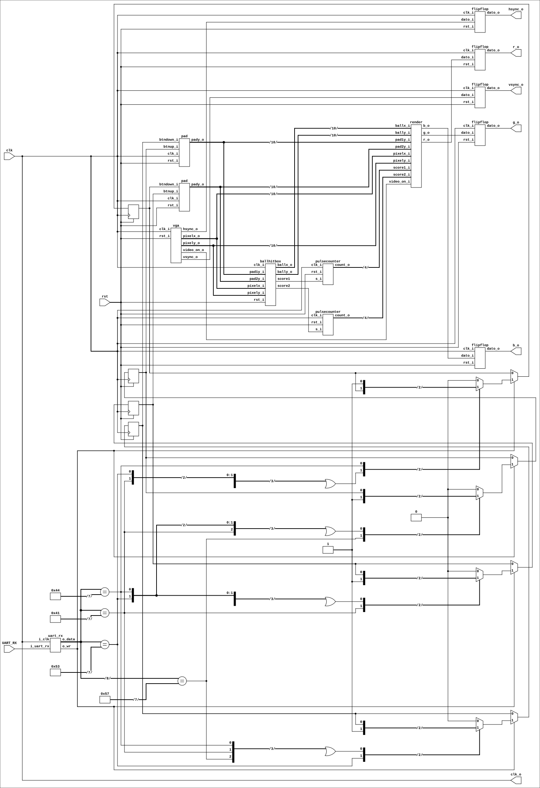
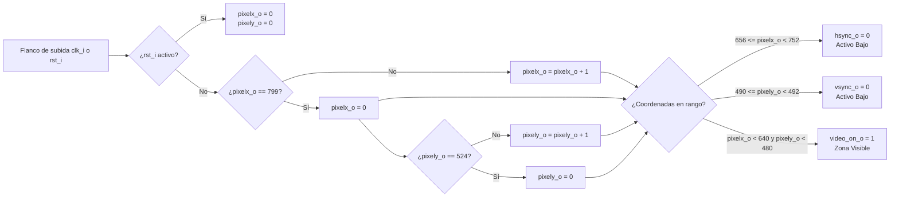
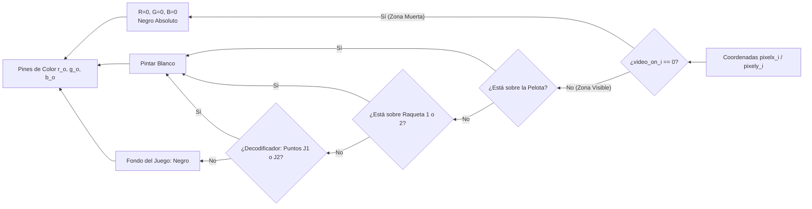
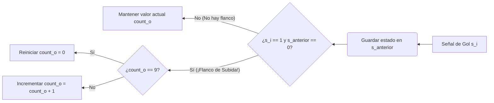
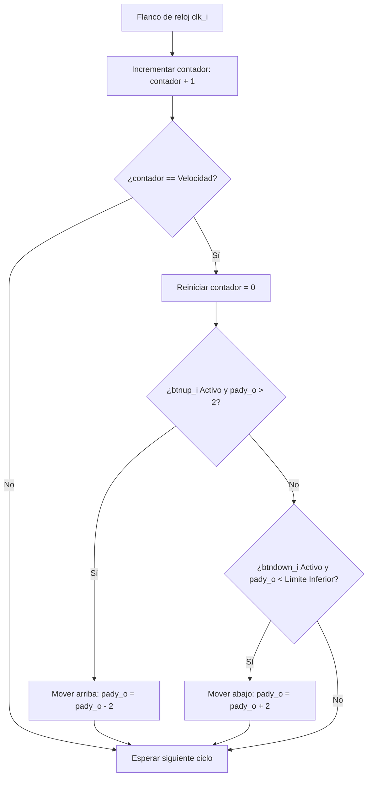
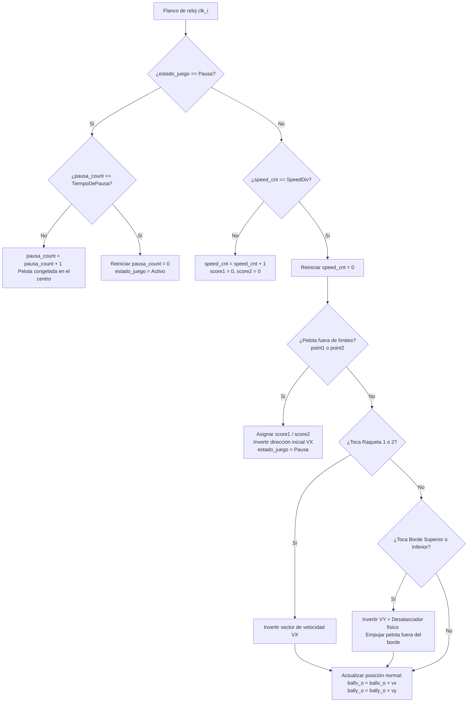

# PONG VGA con Control Bluetooth - FPGA Cyclone IV

Este proyecto consiste en la recreación del clásico juego **Pong** implementado directamente en hardware utilizando una FPGA **Altera Cyclone IV**. El sistema es capaz de generar una señal de video en tiempo real para desplegar los elementos gráficos en cualquier monitor o pantalla con soporte para interfaz **VGA**. Además, el juego incorpora un sistema de control inalámbrico mediante comunicación **Bluetooth**.

---

## Objetivos del Proyecto

Para el desarrollo de este sistema de diseño digital, se implementaron los siguientes módulos de forma síncrona:

* **Protocolo VGA Estable:** Generación precisa de las señales de sincronización horizontal (`H-SYNC`) y vertical (`V-SYNC`) para garantizar una imagen estable y sin parpadeos en resoluciones estándar (ej. 640x480 @ 60Hz).
* **Lógica de Juego y Colisiones:** Procesamiento de la física del juego en hardware, gestionando el rebote dinámico de la bola contra los bordes de la pantalla y las paletas de los jugadores.
* **Sistema de Control:** Implementación de un método de juego sencillo y responsivo.
* **Conectividad Bluetooth:** Integración de un protocolo de comunicación serial inalámbrica utilizando módulos **HC-05** o **HC-06**, permitiendo controlar el movimiento de las paletas de forma externa y remota.

---

## Créditos

Este proyecto fue desarrollado utilizando como base el material académico y las plantillas de diseño de la asignatura de Electrónica Digital de la Universidad Nacional de Colombia.

* **Docente:** [Prof. Johnny Cubides](https://github.com/johnnycubides)
*  **Repositorio Base:** [digital-electronic-1-101 / fpga-example / openep4ce6-c](https://github.com/johnnycubides/digital-electronic-1-101/tree/main/fpga-example/openep4ce6-c)

---

## Asignación de Pines (FPGA Cyclone IV)
| Señal | Pin FPGA | Header de la Placa | Descripción |
| :--- | :---: | :---: | :--- |
| `clk` | PIN_23 | — | Reloj del sistema (Oscilador a bordo) |
| `rst` | PIN_60 | H1_2 | Reinicio del sistema (Reset) |
| `hsync_o` | PIN_64 | H1_3 | Sincronización Horizontal VGA |
| `vsync_o` | PIN_65 | H1_4 | Sincronización Vertical VGA |
| `r_o` | PIN_66 | H1_5 | Canal de Color Rojo VGA |
| `g_o` | PIN_67 | H1_6 | Canal de Color Verde VGA |
| `b_o` | PIN_68 | H1_7 | Canal de Color Azul VGA |
| `clk_o` | PIN_69 | H1_8 | Salida de reloj externa / Test |
| `btn_up1` | PIN_70 | H1_9 | Control Jugador 1 - Mover Arriba |
| `btn_down1` | PIN_71 | H1_10 | Control Jugador 1 - Mover Abajo |
| `btn_up2` | PIN_72 | H1_11 | Control Jugador 2 - Mover Arriba |
| `btn_down2` | PIN_73 | H1_12 | Control Jugador 2 - Mover Abajo |

---

## Explicación del Protocolo VGA

El protocolo VGA (Video Graphics Array) es un estándar de transmisión de video analógico que funciona mediante un barrido secuencial de píxeles, recorriendo la pantalla de izquierda a derecha y de arriba a abajo. 

Para controlar este proceso desde la FPGA Cyclone IV, el sistema gestiona cinco señales principales: tres líneas de color independientes (R, G, B) y dos señales digitales de sincronización llamadas `H-SYNC` (Horizontal) y `V-SYNC` (Vertical).

### 1. Señales del Protocolo

* **Líneas de Color (r_o, g_o, b_o):** Controlan la presencia de los tres colores primarios. En este diseño, al usar canales de 1 bit, se opera en un esquema digital puro (encendido/apagado), permitiendo una paleta básica de colores primarios y secundarios en pantalla.
* **H-SYNC (Sincronización Horizontal):** Señal que indica al monitor el fin de una línea horizontal activa y el retorno del haz hacia el extremo izquierdo para iniciar la siguiente fila de píxeles.
* **V-SYNC (Sincronización Vertical):** Señal que indica al monitor la finalización de un cuadro completo (frame) y el retorno a la esquina superior izquierda para iniciar el dibujo del siguiente cuadro.

### 2. Mecanismo de Barrido y Contadores

La arquitectura en la FPGA utiliza dos contadores síncronos interconectados: un contador horizontal (que mide ciclos de reloj por píxel) y un contador vertical (que incrementa su valor cada vez que el contador horizontal completa una línea).

Para una resolución estándar de **640x480 a 60 Hz**, la zona visible es de 640 columnas por 480 filas. No obstante, el protocolo exige que los contadores alcancen dimensiones mayores debido a los intervalos de temporización analógica heredados de las pantallas de tubo de rayos catódicos (CRT).

### 3. Tiempos de Sincronismo y Zonas Muertas

Tanto el ciclo horizontal como el vertical se dividen estrictamente en cuatro zonas temporales consecutivas:

1. **Visible Area (Zona Activa):** Intervalo donde los datos de los contadores corresponden a las coordenadas físicas de la pantalla. Los canales de color se activan para dibujar objetos (paletas, bola y puntajes).
2. **Front Porch (Pórtico Delantero):** Pequeño desfase de tiempo muerto inmediatamente posterior a la zona activa. Las señales de color deben forzarse a cero.
3. **Sync Pulse (Pulso de Sincronismo):** Intervalo donde la señal de sincronía (`H-SYNC` o `V-SYNC`) cambia a su estado activo (típicamente bajo, `0` lógico).
4. **Back Porch (Pórtico Trasero):** Período de estabilización previo al reinicio de la zona activa. Las señales de color permanecen apagadas.

> **Restricción de Diseño:** Fuera de la Zona Activa (durante los Porches y el Pulso de Sincronismo), las señales `r_o`, `g_o` y `b_o` deben estar obligatoriamente en `0` lógico (Blanking). Enviar datos de color en estas regiones provoca la pérdida de sincronía en el monitor, desalineando la imagen o anulando la señal de video.

### 4. Parámetros de Temporización (640x480 @ 60Hz)

Para implementar esta resolución, se requiere un reloj de píxeles de **25.175 MHz** (aproximado mediante lógica del sistema a 25 MHz desde el oscilador principal). Con esta frecuencia base, los límites de los contadores se configuran bajo las siguientes métricas exactas:

#### Temporización Horizontal (Ciclos de Reloj / Píxeles)

| Etapa del Ciclo | Duración (Píxeles) | Estado de H-SYNC | Estado de Color (R, G, B) |
| :--- | :---: | :---: | :---: |
| **Zona Activa** | 640 | Alto (`1`) | Activo (Datos de video) |
| **Front Porch** | 16 | Alto (`1`) | Apagado (`0`) |
| **Sync Pulse** | 96 | Bajo (`0`) | Apagado (`0`) |
| **Back Porch** | 48 | Alto (`1`) | Apagado (`0`) |
| **Total Línea** | **800** | — | — |

#### Temporización Vertical (Líneas Horizontales)

| Etapa del Ciclo | Duración (Líneas) | Estado de V-SYNC | Estado de Color (R, G, B) |
| :--- | :---: | :---: | :---: |
| **Zona Activa** | 480 | Alto (`1`) | Activo (Datos de video) |
| **Front Porch** | 10 | Alto (`1`) | Apagado (`0`) |
| **Sync Pulse** | 2 | Bajo (`0`) | Apagado (`0`) |
| **Back Porch** | 33 | Alto (`1`) | Apagado (`0`) |
| **Total Cuadro** | **525** | — | — |

---

##  Explicación del Circuito de Interfaz VGA

El acoplamiento eléctrico entre la FPGA Cyclone IV y el conector físico VGA (DB15) requiere un circuito adaptador. Esto se debe a que los pines de la FPGA entregan señales digitales de $3.3\text{ V}$ (TTL), mientras que las entradas de color del monitor VGA son analógicas y aceptan un rango de voltaje máximo de $0\text{ V}$ (negro absoluto) a $0.7\text{ V}$ (máxima intensidad del color).

### 1. Canales de Color y Divisor de Voltaje

Dado que este diseño utiliza un esquema de 1 bit por canal de color (`r_o`, `g_o`, `b_o`), el circuito implementa un divisor de tensión pasivo mediante resistencias en serie. El objetivo es atenuar los $3.3\text{ V}$ de la FPGA hasta los $0.7\text{ V}$ requeridos, considerando que la entrada del monitor ya posee una impedancia interna de carga normalizada de $75\ \Omega$ hacia tierra.

El cálculo del divisor de voltaje se rige bajo la siguiente ecuación de malla:

$$V_{out} = V_{FPGA} \cdot \left( \frac{R_{monitor}}{R_{serie} + R_{monitor}} \right)$$

Sustituyendo los valores estándar ($V_{out} = 0.7\text{ V}$, $V_{FPGA} = 3.3\text{ V}$ y $R_{monitor} = 75\ \Omega$):

$$0.7\text{ V} = 3.3\text{ V} \cdot \left( \frac{75\ \Omega}{R_{serie} + 75\ \Omega} \right)$$

Al despejar $R_{serie}$, se obtiene un valor teórico aproximado de $278.5\ \Omega$. En la práctica, se utilizan resistencias comerciales de **$270\ \Omega$** o **$330\ \Omega$** para proteger los pines de la FPGA y aproximar el voltaje lo más cerca posible al límite del monitor sin saturarlo.

### 2. Señales de Sincronismo (H-SYNC y V-SYNC)

A diferencia de las líneas de color, las señales de sincronización horizontal y vertical son estrictamente digitales. El estándar VGA especifica que estas líneas operan con niveles TTL (donde un '1' lógico puede ser interpretado correctamente desde los $2.4\text{ V}$ hasta los $5\text{ V}$). 

Por lo tanto, los pines `hsync_o` y `vsync_o` de la FPGA se conectan de forma **directa** a los pines correspondientes del conector DB15 (o a través de una resistencia baja de protección de $100\ \Omega$ para mitigar picos de corriente), sin necesidad de un divisor de tensión.

### 3. Diagrama de Conexiones del Conector VGA (DB15)

El mapeo de señales desde el Header de la placa de expansión hacia los pines del conector hembra DB15 se distribuye de la siguiente manera:

| Pin Conector DB15 | Nombre de Señal | Conexión Eléctrica | Origen en FPGA / Header |
| :---: | :--- | :--- | :---: |
| **1** | RED | A través de resistencia de $270\ \Omega$ | `r_o` (PIN_66 / H1_5) |
| **2** | GREEN | A través de resistencia de $270\ \Omega$ | `g_o` (PIN_67 / H1_6) |
| **3** | BLUE | A través de resistencia de $270\ \Omega$ | `b_o` (PIN_68 / H1_7) |
| **13** | H-SYNC | Conexión directa (o con $100\ \Omega$) | `hsync_o` (PIN_64 / H1_3) |
| **14** | V-SYNC | Conexión directa (o con $100\ \Omega$) | `vsync_o` (PIN_65 / H1_4) |
| **5, 6, 7, 8, 10**| GND | Conexión común a tierra | GND de la Placa |

---
## Descripción de Módulos Principales

### 1. Módulo Top (`top.v`)

Este archivo constituye la entidad de nivel superior (Top-Level Entity) del proyecto. Su función principal es la infraestructura y la interconexión síncrona de todos los submódulos del sistema, orquestando el flujo de datos entre las entradas físicas (botones de control), el procesamiento lógico/físico y las salidas analógicas hacia la interfaz VGA.

### 2. Controlador VGA (`vga.v`)
Es el encargado de controlar los tiempos de la pantalla para una resolución estándar de **640x480 a 60 Hz**. No genera colores, sino que crea la "rejilla" invisible de coordenadas para saber dónde dibujar.

* **Contadores X / Y:** Recorren la pantalla píxel por píxel (de 0 a 799 horizontalmente) y línea por línea (de 0 a 524 verticalmente).
* **Señales de Sincronismo (`hsync_o` / `vsync_o`):** Le indican al monitor exactamente cuándo reiniciar la trayectoria para dibujar la siguiente línea o el siguiente cuadro de video.
* **Zona Visible (`video_on_o`):** Una bandera que se activa en alto (`1`) solo cuando el contador está dentro del área visible (640x480). Sirve para apagar los colores por completo durante los tiempos muertos del monitor.

### 3. Motor de Renderizado (`render.v`)
Es el encargado de la generación gráfica del juego. Recibe las coordenadas actuales del barrido de pantalla y las posiciones de los objetos para decidir en tiempo real qué píxeles debe iluminar.

* **Dibujo de Objetos:** Define las regiones geométricas de la pelota (un cuadro de 20x20 píxeles) y de ambas raquetas (rectángulos de 30x80 píxeles) mediante comparadores lógicos.
* **Marcador Virtual (7 Segmentos):** Implementa dos decodificadores basados en la estructura clásica de un display de 7 segmentos. En lugar de encender LEDs físicos, el código enciende bloques de píxeles horizontales (`is_h`) y verticales (`is_v`) en la parte superior de la pantalla para proyectar los números del puntaje (0 a 9).
* **Prioridad y Color:** Controla el color final mediante un bloque combinacional condicional. Si la pantalla está en zona muerta (`!video_on_i`), apaga las salidas. Si está en zona visible, evalúa qué objeto se encuentra en la coordenada actual para pintarlo de color blanco sobre un fondo negro por defecto.

### 4. Contador de Pulsos (`pulsecounter.v`)
Es el componente síncrono encargado de llevar el registro y control del puntaje individual de cada jugador a lo largo de la partida.

* **Detector de Flanco de Subida:** Utiliza un registro interno para almacenar el estado previo de la señal de gol (`s_i`). Al comparar el estado actual con el anterior, el sistema detecta con precisión el instante exacto en que la señal pasa de un cero a un uno lógico, evitando falsos conteos o incrementos múltiples durante un mismo evento.
* **Lógica de Conteo Síncrono:** Cada vez que se valida un flanco de subida, el contador incrementa su valor en una unidad.
* **Límite de Puntuación:** Restringe el conteo acumulado a un valor máximo de 9 (`4'd9`). Al recibir un pulso adicional estando en este límite, el registro se reinicia automáticamente a cero (`4'd0`) para ajustarse a las restricciones de un solo dígito del motor de renderizado gráfico.

### 5. Lazo de Seguimiento de Fase (`pll25mhz.v`)
Es el componente de hardware dedicado a la gestión de frecuencias del sistema, encargado de generar el reloj base síncrono para el protocolo de video.

* **Instanciación del Bloque IP `altpll`:** Utiliza la macro primitiva específica de Altera/Intel para la familia Cyclone IV E, aprovechando los bloques analógicos dedicados dentro del chip en lugar de consumir celdas lógicas de la FPGA.
* **División de Frecuencia Estable:** Configura una relación de división por dos (`clk0_divide_by = 2`) y multiplicación por uno (`clk0_multiply_by = 1`). Esto transforma la señal del oscilador físico de la placa de $50\text{ MHz}$ en una salida síncrona y estable de $25\text{ MHz}$, requerida como reloj de píxel (Pixel Clock).
* **Ciclo de Trabajo y Estabilización:** Garantiza un ciclo de trabajo simétrico del $50\%$ (`clk0_duty_cycle = 50`) y compensa activamente los retardos internos de propagación del silicio, proporcionando una señal inmune a fluctuaciones (jitter) para evitar parpadeos en la imagen.

> **Nota de Diseño:** El uso de este módulo IP dedicado no es estrictamente obligatorio para este proyecto. Debido a que la frecuencia requerida ($25\text{ MHz}$) es exactamente la mitad de la frecuencia del reloj principal de la FPGA ($50\text{ MHz}$), este bloque se podría reemplazar fácilmente por un divisor de frecuencia básico implementado con un único flip-flop tipo D. Conectando la salida negada ($\bar{Q}$) a su propia entrada ($D$) y usando el reloj de $50\text{ MHz}$ como señal de disparo, se obtiene una señal síncrona de $25\text{ MHz}$ consumiendo el mínimo de recursos lógicos.

### 6. Controlador de Raqueta (`pad.v`)
Este módulo se encarga de calcular y actualizar la posición vertical ($Y$) de una raqueta individual en la pantalla, respondiendo a los comandos de entrada del usuario y respetando los límites del área de juego.

* **Divisor de Frecuencia por Contador:** Implementa un contador síncrono interno de 20 bits que compara su valor con el parámetro `Velocidad` (`300,000` ciclos). Esto actúa como un divisor de tiempo que ralentiza el movimiento de la raqueta para hacerlo jugable frente a los $25\text{ MHz}$ del reloj principal.
* **Control de Movimiento Condicional:** Cuando el contador llega a su límite, se evalúa el estado de los botones físicos:
  * Al presionar el botón de subir (`btnup_i`), la coordenada vertical disminuye en 2 píxeles (`pady_o - 2`).
  * Al presionar el botón de bajar (`btndown_i`), la coordenada aumenta en 2 píxeles (`pady_o + 2`).
* **Protección de Desbordamiento y Límites:** El código incluye condicionales de control crítico para evitar que la raqueta abandone el área visible. Restringe el límite superior de modo que la coordenada nunca baje de 2 (`> 10'd2`), previniendo un subdesbordamiento numérico (underflow), y limita el movimiento inferior restando la altura de la raqueta al tamaño máximo vertical de la pantalla (`MaxPantallaY - TamanoPad`), evitando que el objeto desaparezca por el borde inferior.

### 7. Registro Síncronizado (`flipflop.v`)
Este módulo implementa un elemento de almacenamiento básico de 1 bit (Flip-Flop tipo D) con reset asíncrono, utilizado como celda de memoria síncrona.

* **Sincronización por Flanco:** Captura el valor presente en la entrada de datos (`dato_i`) exactamente en el flanco de subida del reloj (`clk_i`) y lo transfiere a la salida (`dato_o`), manteniéndolo estable hasta el siguiente ciclo.
* **Reset Asíncrono:** Prioriza la señal de reinicio (`rst_i`). Sin importar el estado del reloj, si esta señal se activa en alto, la salida se fuerza inmediatamente a cero (`1'b0`).
* **Función en el Sistema (Anti-Glitch):** Al instanciarse en el módulo *Top* justo antes de los pines físicos, actúa como una barrera de registro que alinea temporalmente las señales de video y sincronismo. Esto elimina los retrasos acumulados en las etapas combinacionales previas, previniendo distorsiones o ruidos visuales en el monitor.

### 8. Motor de Física y Colisiones (`ballhitbox.v`)
Este módulo calcula las coordenadas lógicas en dos dimensiones ($X, Y$) de la pelota, procesando las colisiones mecánicas del juego y la lógica de anotación de puntos.

* **Detección de Colisiones (Hitboxes):** Utiliza lógica combinacional continua para evaluar tres condiciones críticas en cada ciclo de barrido:
  * `hit_pad1` y `hit_pad2`: Comprueban si la coordenada de la pelota coincide con la ubicación espacial y la altura de las raquetas izquierda o derecha.
  * `hit_top_bottom`: Verifica si el objeto impacta contra el marco superior ($Y \le 10$) o inferior ($Y \ge 470$) de la pantalla.
* **Control de Movimiento y Desatascador Físico:** El vector de velocidad (`vx`, `vy`) modifica de forma síncrona la posición de la pelota. Cuenta con un sistema de corrección de posición: al impactar un borde superior o inferior, el hardware no solo invierte el sentido de la velocidad, sino que fuerza una nueva coordenada (`12` o `468`), evitando que el objeto quede atrapado o vibre indefinidamente en los límites del lienzo.
* **Sistema de Anotación y Reinicio:** Determina la condición de punto si la pelota sobrepasa los extremos laterales (`point1` o `point2`). Al ocurrir un gol, activa un pulso de salida (`score1` o `score2`) hacia los contadores del sistema y reubica la pelota en el centro de la pantalla (`Centerx`, `Centery`).
* **Máquina de Estados de Pausa:** Implementa un temporizador síncrono (`pausa_count`) controlado por el registro `estado_juego`. Al anotar un punto, el sistema entra en modo de pausa durante un segundo (congelando el juego en el centro) antes de reanudar el movimiento y lanzar la pelota en la dirección del jugador que acaba de recibir el gol.

